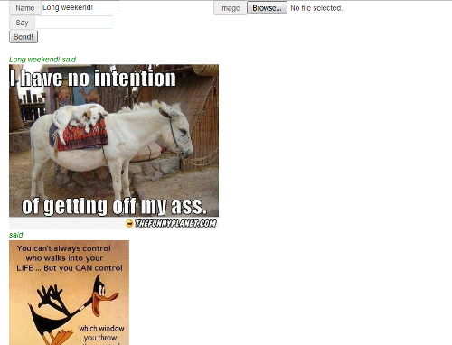

# Chat-in-a-box

A simple single page web based group chat with picture posting, ready to deploy to a Docker container.

I built this as an exercise to build a rails app from development through creating a production ready app and to learn a little about websockets.

No user authentication, so you can just start talking and wasting time uploading pictures of things with words on them.

I haven't placed much effort into locking anything down against form injection, so don't deploy this anywhere public-facing, or squirrel-facing, or near angry hacker grandmas.  It will probably compromise your entire network and burn your toast.

On the bright side, it should only take about 5 minutes to get everything running.

## Get it running

This assumes you have Docker running and know how to build a basic image and run a container.
No reason you have to use Docker though, I suppose you could deploy it wherever using whatever internetty uploady thingy you like.

1. Clone this repo.

2. Edit app/assets/javascripts/post.js and change 'localhost:3000' to whatever the hostname or IP of your production server will be.

3. Build the image with 'docker build -t myrepo/myappname:version .'

4. Run it with 'docker run -d --name most_awesome_chat_ever -p 3000:3000 myrepo/myappname:version' If you modify the outward facing port, also update it in post.js (step 2).

5. Waste time with your coworkers.

## Random notes

If you want to scrub the database/image uploads each day, you can either start a new container in the morning, or run the daily_clean.sh script via cron / systemd / robot chipmunks on your host:

docker exec containername /bin/bash -c '/usr/src/app/daily_clean.sh'

## Screenshot(s)

I'll write in something soon so "said" disappears if you don't type a name in.
